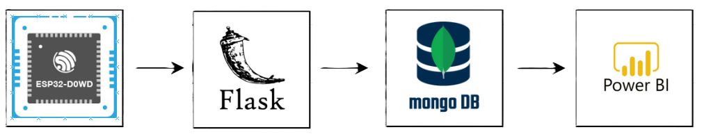
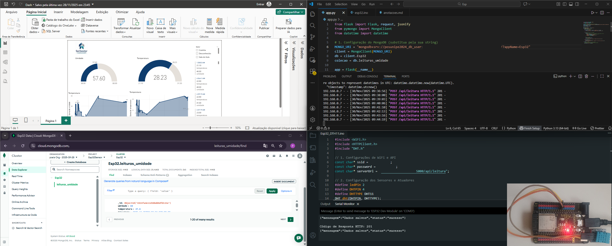
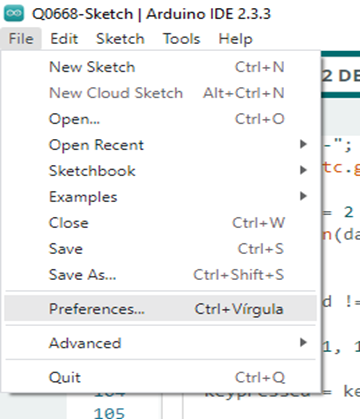
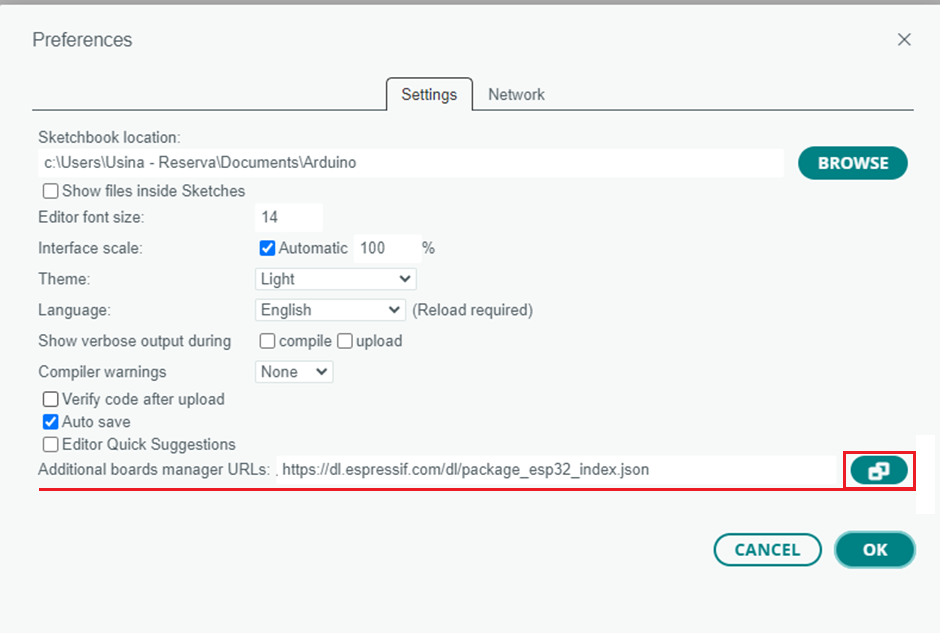
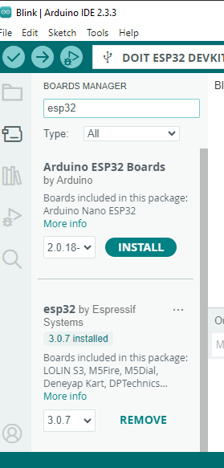
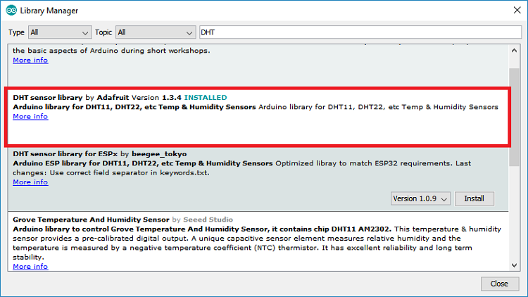
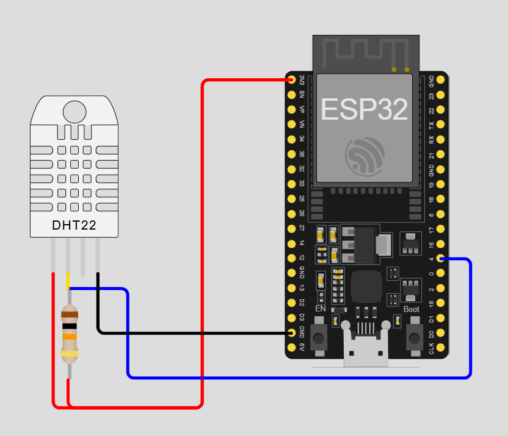
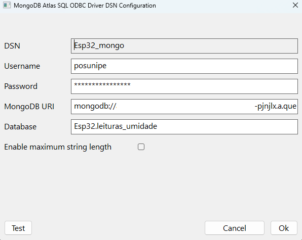
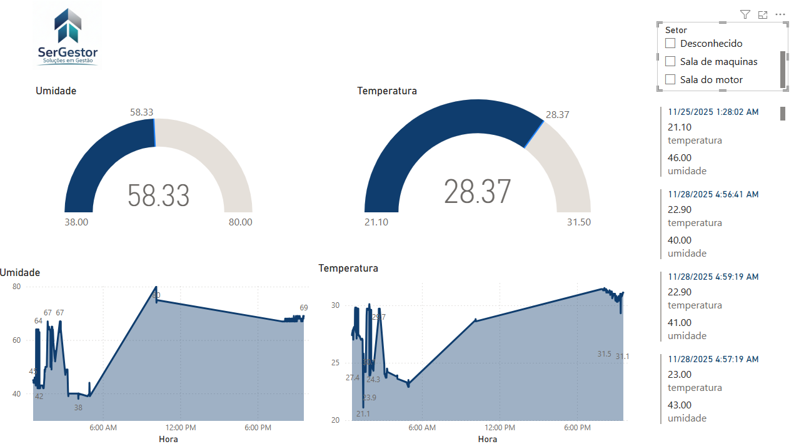

# MBA EM BUSINESS INTELLIGENCE E BIG DATA 

##  Engenharia de sistemas embarcados com dados para Iot

### Wandeilson Ferreira 

## Índice

- [Apresentação da disciplina](#Apresentação-da-disciplina)
- [Sobre o projeto](#Sobre-o-projeto)
- [Arquitetura](#Arquitetura)
- [Desenvolvimento](#Desenvolvimento)
- [Esp32](#Esp32)
- [API Flask](#API-Flask)
- [MongoDB](#MongoDB)
- [Conector ODBC](#Conector-ODBC)
- [Power BI](#Power-BI)


## Apresentação da disciplina 

A disciplina de Engenharia de Sistemas Embarcados com Dados para IoT, ministrada pelo professor [Celso Machado Maia Padilha](https://www.linkedin.com/in/celsopadilha/), tem como objetivo proporcionar uma compreensão dos fundamentos de sistemas embarcados e sua integração com soluções de Internet das Coisas (IoT). O curso busca desenvolver competências técnicas e estratégicas para projetar, implementar e gerenciar dispositivos inteligentes conectados, capazes de coletar, processar e transmitir dados em ambientes distribuídos.

### Conteúdo Abordado
Ao longo do curso, foram explorados conceitos essenciais relacionados às principais teorias e práticas da área, proporcionando uma compreensão sólida e aplicada dos seguintes conteúdos:
- Arquitetura de sistemas embarcados: microcontroladores, sensores e atuadores.
- Protocolos de comunicação para IoT: MQTT e HTTP.
- Integração de hardware e software: programação em C/C++ e Python.
- Coleta e transmissão de dados: aquisição de informações via sensores e transmição atraves do protocolo http.


## Sobre o projeto

O projeto tem como objetivo desenvolver uma solução completa de coleta, armazenamento e visualização de dados ambientes (umidade e temperatura) atraves do sensor DTH11, integrando dispositivos embarcados, banco de dados NoSQL e ferramentas de Business Intelligence.

### Arquitetura  

<br>

<center>

    

<figcaption>Fluxo do Projeto</figcaption>

</center>

<br>


O projeto utiliza o ESP32 para coletar dados de temperatura e umidade por meio do sensor DHT11/DHT22, aproveitando sua conectividade Wi-Fi para enviar as informações ao MongoDB via API REST em Flask, que organiza os dados em formato JSON e os persiste no MongoDB; cada leitura é registrada com local, timestamp, temperatura e umidade, e posteriormente integrada ao Power BI via conector ODBC, permitindo a criação de um dashboard interativo com gráficos de evolução, alertas visuais para valores fora da faixa e estatísticas médias, mínimas e máximas, facilitando a análise dinâmica e a tomada de decisão sobre condições ambientais.

<br>

<center> 


<figcaption>Projeto em Execução</figcaption>

</center>

<br>


### Desenvolvimento

#### Esp32

O ESP32 é um microcontrolador de baixo custo e alto desempenho, desenvolvido pela Espressif, que se destaca por integrar conectividade Wi-Fi e Bluetooth em um único chip, tornando-se ideal para aplicações em IoT e sistemas embarcados, possibilitando o desenvolvimento de soluções completas que vão desde a coleta de dados em dispositivos inteligentes até a transmissão e análise em plataformas na nuvem.

##### Configuração do ESP32 na IDE do Arduino 
Para configurar o ESP32 na Arduino IDE e aproveitar a mesma interface do Arduino, basta instalar o suporte ao ESP32 na IDE da seguinte forma:

<br>

<center>


<figcaption>Configurando o ESP32 no Arduino IDE</figcaption>

<br>


<figcaption>No campo “URLs adicionais para gerenciadores de placas”, insira o link do repositório do ESP32</figcaption>

</center>

<br>

Por fim, precisamos importar as Placas ESP32 através de Ferramentas > Placa > Gerenciador de Placas e importar “ESP32 by Espressif Systems”.

<br>

<center>


<figcaption>Selecione ESP32 by Espressif Systems</figcaption>

</center>

<br>


##### Sensor DHT11/DHT22
Os sensores DHT11 e DHT22 são dispositivos eletrônicos amplamente utilizados para medir temperatura e umidade em projetos de IoT e automação, oferecendo simplicidade de uso e baixo custo.

Para sua utilização devemomos importar a biblioteca DTH, fornecida pela Adafruit.
<br>

<center>


<figcaption>Selecione ESP32 by Espressif Systems</figcaption>

</center>

<br>


##### Hardware
<br>

<center>


<figcaption>Estação de coleta</figcaption>

</center>

<br>

##### Software
A aplicação foi desenvolvida na linguagem Arduino, que é baseada em C/C++. O código conecta o microcontrolador à rede Wi-Fi, lê dados de temperatura e umidade do sensor DHT11, organiza essas informações em formato JSON junto com o nome do local, e envia tudo para uma API por meio de uma requisição HTTP POST; caso o envio seja bem-sucedido, o LED pisca cinco vezes para indicar sucesso, e todo o processo é repetido a cada cinco segundos. 

```
#include <WiFi.h>
#include <HTTPClient.h>
#include "DHT.h" 

// 1. Configurações de WiFi e API
const char* ssid = "motog_5458";
const char* password = "unipe2025";
const char* serverUrl = "http://xx.xxx.xx.x:5000/api/leitura";
 

// 2. Configuração dos Sensores e Atuadores
#define ledPin 2
#define DHTPIN 4     
#define DHTTYPE DHT11 
DHT dht(DHTPIN, DHTTYPE);

void setup() {
  pinMode(ledPin, OUTPUT);
  Serial.begin(115200);
  dht.begin();
  
  // Conecta ao Wi-Fi
  WiFi.begin(ssid, password);
  while (WiFi.status() != WL_CONNECTED) {
    delay(1000);
    Serial.println("Conectando ao WiFi...");
  }
  Serial.println("Conectado ao WiFi!");
  digitalWrite(ledPin, HIGH);

}

void loop() {
  // Lê as informações do sensor
  float h = dht.readHumidity();
  float t = dht.readTemperature();
  String local = "Sala do Motor";
  
  // Verifica se a leitura foi bem-sucedida
  if (isnan(h) || isnan(t)) {
    Serial.println("Falha ao ler o sensor DHT!");
    delay(1000);
    return;
  }
  
  // Converte as leituras para o formato JSON
  String jsonPayload = "{";
  jsonPayload += "\"Setor\": \"" + local + "\",";   // usa a variável local
  jsonPayload += "\"umidade\": " + String(h, 2) + ",";
  jsonPayload += "\"temperatura\": " + String(t, 2);
  jsonPayload += "}";

  // Envia a requisição HTTP POST
  HTTPClient http;
  http.begin(serverUrl);
  http.addHeader("Content-Type", "application/json");

  int httpResponseCode = http.POST(jsonPayload);
  
  if (httpResponseCode > 0) {
    Serial.print("Código de Resposta HTTP: ");
    Serial.println(httpResponseCode);
    String response = http.getString();
    Serial.println(response);
    for (int i=0; i<5;i++){
        digitalWrite(ledPin, LOW);
        delay(300);
        digitalWrite(ledPin, HIGH);
        delay(300);
    }      
      
  } else {
    Serial.print("Erro no envio HTTP. Código: ");
    Serial.println(httpResponseCode);
  }
  
  http.end(); // Fecha a conexão
  
  // Próxima leitura
  delay(5000); 
}

```

#### API Flask 
Uma API Flask é uma aplicação desenvolvida com o micro‑framework Flask em Python que permite criar interfaces de comunicação entre sistemas de forma simples e flexível.
O Flask é um micro‑framework de desenvolvimento web em Python, conhecido por sua leveza e facilidade de uso, que possibilita criar aplicações e serviços sem a complexidade de frameworks maiores.

```
from flask import Flask, request, jsonify
from pymongo import MongoClient
from datetime import datetime

# 1. Configuração do MongoDB (substitua pela sua string)
MONGO_URI = "mongodb+srv://<user>>:<senha>>@esp32.9igsjch.mongodb.net/?appName=Esp32"


client = MongoClient(MONGO_URI)
db = client.Esp32
colecao = db.leituras_umidade

app = Flask(__name__)

@app.route('/api/leitura', methods=['POST'])
def receber_leitura():
    # Recebe os dados JSON do ESP32
    dados = request.get_json()

    if not dados or 'umidade' not in dados or 'temperatura' not in dados:
        return jsonify({"status": "erro", "mensagem": "Dados incompletos"}), 400

    try:
        # Prepara o documento para o MongoDB
        documento = {
            #"Setor": dados.get('local', 'Desconhecido'),  # valor padrão se não vier
            "Setor": dados['Setor'], # valor padrão se não vier            
            "umidade": float(dados['umidade']),
            "temperatura": float(dados['temperatura']),
            "timestamp": datetime.utcnow()
        }

        # Insere no MongoDB
        colecao.insert_one(documento)

        return jsonify({"status": "sucesso", "mensagem": "Dados salvos"}), 201

    except Exception as e:
        print(f"Erro ao salvar: {e}")
        return jsonify({"status": "erro", "mensagem": "Erro interno do servidor"}), 500

if __name__ == '__main__':
    # Execute em um servidor acessível pelo ESP32
    # Use host='0.0.0.0' para que seja acessível externamente
    app.run(host='0.0.0.0', port=5000)
```


#### MongoDB
O MongoDB é um banco de dados NoSQL orientado a documentos, projetado para oferecer alta flexibilidade, desempenho e escalabilidade no armazenamento e gerenciamento de dados.
Ele se diferencia dos bancos relacionais tradicionais porque não utiliza tabelas e colunas, mas sim coleções e documentos no formato JSON/BSON, o que permite armazenar dados de maneira mais dinâmica e sem a necessidade de esquemas rígidos. Essa característica torna o MongoDB especialmente útil em aplicações modernas, como sistemas de IoT, análise de grandes volumes de dados e aplicações web que precisam lidar com informações heterogêneas e em constante evolução.

Para estabelecer a conexão da nossa API com o MongoDB, podemos seguir os seguintes passos disponíveis em: [Configuração do mongoDB](https://github.com/WandeilsonFerreira/MBA-BI-e-Big-Data/blob/main/8%20-%20Banco%20de%20dados%20SQL%20e%20NoSQL/README.md#desenvolvimento-da-aplica%C3%A7%C3%A3o).


#### Conector ODBC
Antes de iniciarmos a conexão com o Power BI, é necessário configurar o conector ODBC para atender a ferramentas de visualização, já que o MongoDB não disponibiliza gratuitamente uma conexão direta.

<br>

<center>


<figcaption>Conector</figcaption>

</center>

<br>

A configuração do conector pode ser vista na seção de configurações da ferramenta, disponiveis atraves do seguinte [link](https://github.com/WandeilsonFerreira/MBA-BI-e-Big-Data/blob/main/8%20-%20Banco%20de%20dados%20SQL%20e%20NoSQL/README.md#integra%C3%A7%C3%A3o-com-ferramentas-de-bi).

#### Power BI
Após a conclusão do processo de instalação e configuração, podemos iniciar a análise dos dados diretamente no Power BI, utilizando a conexão estabelecida com o cluster do MongoDB. Inicialmente, é necessário importar os dados do bucket online por meio do nosso [conector](https://github.com/WandeilsonFerreira/MBA-BI-e-Big-Data/blob/main/8%20-%20Banco%20de%20dados%20SQL%20e%20NoSQL/README.md#power-bi).

##### Dashboard
Por fim, com base nos dados de umidade e temperatura coletados e carregados, geramos o seguinte relatório, que tem como objetivo apoiar os tomadores de decisão na identificação de padrões de variação, avaliação das condições ambientais e definição de estratégias mais assertivas. As visualizações apresentadas facilitam a interpretação das informações e contribuem para decisões mais embasadas e eficazes no seu monitoramento.

<br>

<center>


<figcaption>Dashboard</figcaption>

</center>

<br>

 

