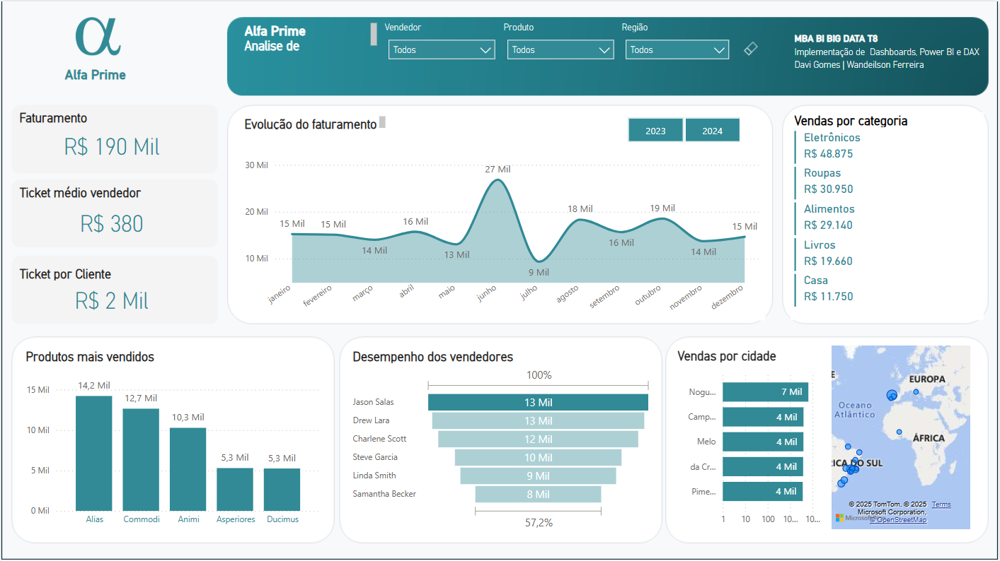
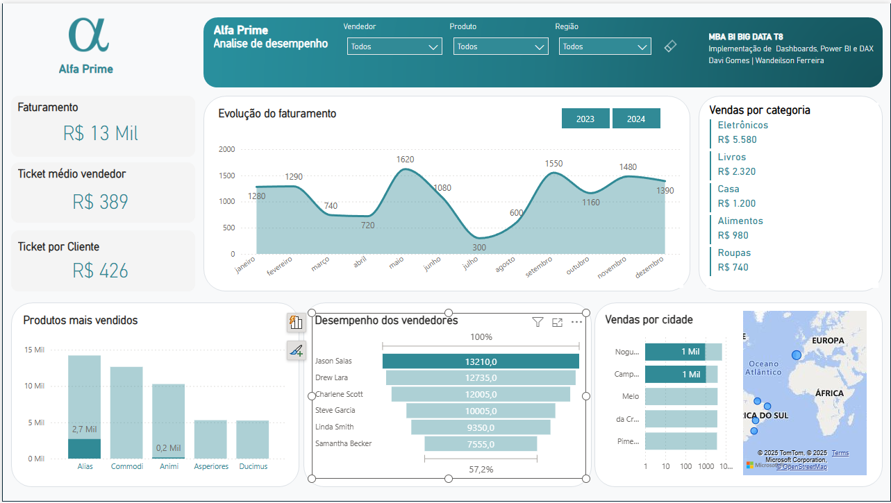

# MBA EM BUSINESS INTELLIGENCE E BIG DATA 

### IMPLEMENTAÇÃO DE DASHBOARDS, CONSULTAS OLAP E RELATÓRIOS – “Power BI e DAX” e Tableau.

#### Davi Gomes | Wandeilson Ferreira 

## Alfa Prime – Análise de Desempenho

### Objetivo do Projeto
Apresentar uma análise detalhada dos dados operacionais de vendas de uma unidade da rede Alfa Prime, com foco na identificação de oportunidades de melhoria e no destaque do desempenho individual dos vendedores.

### Objetivo da Análise:
O projeto tem como finalidade realizar uma análise dos dados operacionais de vendas de uma unidade de rede de lojas, com o intuito de avaliar indicadores como: faturamento total, média de compras e vendas, evolução do faturamento ao longo do tempo, categorias mais relevantes, produtos mais vendidos, desempenho individual dos vendedores e volume de vendas por cidade.

Com base nesses indicadores, busca-se identificar, de forma fundamentada, quais vendedores apresentam o melhor desempenho, considerando os dados obtidos durante o período analisado.

### Indicadores Avaliados
- Faturamento Total
- Média de Compras/Vendas
- Evolução de Faturamento Mensal
- Categorias Mais Relevantes
- Produtos Mais Vendidos
- Vendas por Cidade
- Desempenho Individual dos Vendedores
  
    

### Problema Central
Qual vendedor apresenta o melhor desempenho com base no conjunto dos principais indicadores comerciais?

### Resultados Encontrados

Com base nos dados avaliados concluimos que o vendedor **Jason Salas** apresentou o melhor desempenho. 
- **Destacando:**
  - Faturamento: R$ 13210,0.
  - Categoria mais representariva: eletrônicos.
  - Produto mais vendido: Alias.
  - Cidade mais relevante para vendas: Nougueira- Portugal.

   

### Recomendações 

- Redirecionar estratégias para regiões com baixo desempenho
- Reconhecer e replicar boas práticas dos vendedores de destaque
# MBA---Dashboards-Consultas-OLAP
